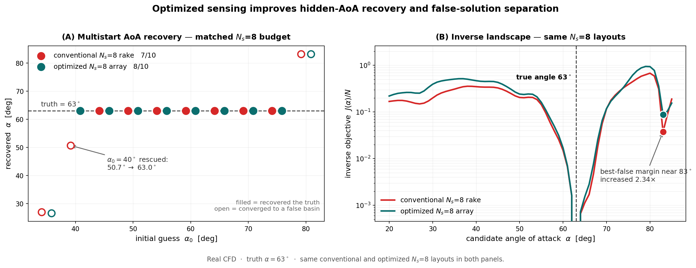

# Differentiable Sensor Design for Wake-Based Flow Inference

> **Don't just add sensors. Put them where the physics is more informative.**

I present here a differentiable workflow composed of four Tesseracts. It first infers the angle of attack (AoA) of a "hidden" flat plate from a small set of sparse wake probes, and then uses end-to-end gradients to decide *where those probes should be placed* so as to maximize the ability to identify the AoA. The workflow combines immersed-boundary CFD in Julia with a differentiable JAX chain for measurement, surrogate and experimental design.

<p align="center">
  
</p>

<p align="center"><em>Local optimization improves the conventional rake, while differentiable design with multiple initializations finds a stronger configuration distributed between the near- and far-wake regions.<br>Probe trajectories come from the frozen T3→T4 campaign at <code>h = 0.05</code>; the α = 63°, t = 20 wake is rendered at <code>h = 0.02</code> for visualization only.</em></p>

---

## The scientific problem

A thin flat plate sits at a fixed, unknown angle of attack `α` in a Re = 200 fluid-flow and a final simulation time of 20s. Depending on the AoA, we note the presence of vortex shedding as seen in Fig. 1(A). Downstream, point probes record the velocities `ux, uy` at five instants `t ∈ [12.0, 13.3, 15.1, 17.4, 20.0]`. The flow is simulated with [Immersa.jl](https://github.com/NUFgroup/Immersa.jl), a Julia CFD solver based on the Immersed Boundary Method [1] for fluid–structure interaction problems. The problem motivation can be resumed into two questions:

1. **Can sparse wake measurements recover a hidden AoA?**
2. **And more importantly,  can we position the probes to better distinguish between different AoA's?**

The difficulty lies in aliasing: different plate angles can produce nearly indistinguishable wakes at a badly chosen probe location. The inverse objective then develops spurious local minima, and a solver started on the wrong side can converge confidently to the wrong angle. Here, the worst alias occurs for the pair [**63°**, **83°**].

The natural reflex would be to simply add more probes, for example, forming a denser cross-stream distribution at a single downstream coordinate in x, as seen in Fig. 1(B1). However, Fig. 1(B2) shows that once optimized, such an array only samples the same structures more densely (near-body wake), instead of observing different regions. Indeed, increasing the number of aligned probes does not necessarily lead to greater discrimination per measurement, since additional measurements in the same region can become redundant. The sensor coordinates, on the other hand, are continuous variables, and the entire measurement chain is differentiable with respect to them. This makes it possible to use gradients not only to infer the AoA, but also to design the experiment itself, determining where the probes should be placed to make different AoA more distinguishable.

There is also a computational difficulty. The mechanistic model is `Immersa.jl`, while the observation, the surrogate and the sensor design are naturally implemented with JAX. Moreover, these components operate at very different cost scales and do not use the same differentiation strategy.

The challenge, therefore, is not only to solve the inverse problem or to optimize the probe positions. It is to build a workflow in which these heterogeneous pieces can take part in a single differentiable chain, while preserving their natural implementations.

---

## Why Tesseract?

<p align="center">
  
</p>

The workflow crosses a real boundary and is composed of four Tesseracts, each responsible for a distinct stage of the inference and design chain. `ImmersaForward` (T1) solves the flow physics; `WakeObservation` (T2) turns the dense fields into sparse measurements at the probe positions; `WakeSurrogate` (T3) is a coordinate-based differentiable surrogate of the velocity observable map over the sensor-design region; and `SensorArrayDesign` (T4) quantifies how well a given sensor configuration distinguishes different AoAs.

|        | Component                                                            | Role        | Maps                                            | Stack              | Differentiation                                  |
| :----- | :------------------------------------------------------------------ | :---------- | :---------------------------------------------- | :----------------- | :----------------------------------------------- |
| **T1** | [`immersa_forward`](components/tesseracts/immersa_forward/)         | Physics     | `α` → dense fields `ux(x,y,t), uy(x,y,t)`       | Julia + Immersa.jl | Central differences in AoA, inside the component |
| **T2** | [`wake_observation`](components/tesseracts/wake_observation/)       | Experiment  | dense fields + sensors `s` → sparse `ux, uy`    | Python + JAX       | JAX AD                                           |
| **T3** | [`wake_surrogate`](components/tesseracts/wake_surrogate/)           | Speed       | `(α, x, y)` → `ux, uy` at the five observation times       | Equinox + JAX      | JAX AD                                           |
| **T4** | [`sensor_array_design`](components/tesseracts/sensor_array_design/) | Design      | measurement batch → discrimination `D_τ`      | JAX                | JAX AD                                                        |

This problem does not correspond to a single homogeneous chain `T1 → T2 → T3 → T4`. Instead, the project uses three distinct computational routes. The first is used for physical AoA inference, while the other two are complementary routes for sensor design and evaluation.

**Physical inverse-inference route — `T1 → T2 → inverse optimizer`.** `ImmersaForward` receives a candidate AoA and computes the dense CFD field. `WakeObservation` samples that field at the probe locations, and the resulting measurements are compared with the observed data by the inverse optimizer, which updates the AoA.


**High-fidelity sensor-design route — `T1 → T2 → T4`.** This route reuses the same mechanistic `T1 → T2` measurement path, but instead of sending the probe measurements to the inverse optimizer, it sends a measurement batch spanning candidate AoAs to `SensorArrayDesign`. T4 then evaluates how well the current sensor layout distinguishes those AoAs.


**Cheap design route — `T3 → T4`.** `WakeSurrogate` was trained to approximate the observable map represented by `T1 → T2`: given `(α, x, y)`, it predicts `ux, uy` at the five observation times, anywhere in the trained sensor-design region. During optimization it is queried only at the current candidate sensor coordinates, so it bypasses both the expensive CFD solve and the sampling operation in `T2`. Its measurement batch is passed to the same `SensorArrayDesign`. Conceptually `T3 ≈ T2 ∘ T1`, but only for the observable map needed for experiment design, never for the full CFD state.

The two sensor-design routes meet at the same interface: the **measurement batch**. The mechanistic route `T1 → T2` and the surrogate route `T3` produce the same type of observable, allowing `T4` to score either one without knowing how those measurements were obtained.

This separation matters because the components are deeply heterogeneous. The physical solver is implemented in Julia, costs minutes per evaluation, and is not natively differentiable: its AoA sensitivity is computed internally with central finite differences. The observation, surrogate and design components, by contrast, are in Python/JAX, cost milliseconds and use automatic differentiation. Tesseract allows these components to be treated as differentiable parts of a single workflow without requiring them to share a language, an implementation or a differentiation strategy.

Each Tesseract declares its differentiable inputs and outputs and exposes derivative endpoints, allowing the application to compose gradients across those boundaries without needing to know how they were computed internally. In particular, **the AoA derivative is encapsulated inside T1's differentiation boundary**: the application requests `∂(ux, uy)/∂α` from `ImmersaForward` and receives it directly, without needing to know whether it came from central finite differences, a future tangent-linear method, or an adjoint. Immersa.jl was not rewritten for native AD — the choice of differentiation strategy stays local to T1 and could change without affecting the other components.

T4 scores the measurement batch using a soft minimum over pairwise measurement distances, normalized per scalar measurement so that different sensor budgets can be compared.

---

## Result 1 — Optimized placement makes each measurement more informative

**How a layout is scored.** For a fixed sensor layout, every candidate angle of attack produces its own vector of probe measurements. The *worst-case discrimination* is the distance between the hardest-to-distinguish pair of sufficiently separated angles, so a larger value means that even the most similar candidate wakes are easier to tell apart. Dividing by the number of measured scalar values gives the **per-scalar-measurement** version, which lets layouts with different sensor budgets be compared fairly. **Real-CFD** means those measurements are sampled from Immersa.jl fields rather than generated by T3: the surrogate is used to search for layouts, never to score them here.

**The 66-AoA CFD bank.** For physical evaluation, a bank of Immersa.jl solutions was precomputed at 66 different angles of attack. Because the probes are passive, those same persisted flow fields can be sampled through T2 at any candidate sensor positions, so conventional and optimized layouts are evaluated on exactly the same physical data without rerunning CFD for every sensor movement.

<p align="center">
  
</p>

For each sensor budget `Ns = 1, 2, 3, 5, 8`, the differentiable T3 → T4 objective is optimized from 10 initial layouts — the conventional rake plus nine random starts — and the best final layout is frozen before any mechanistic evaluation. The multistart search reduces sensitivity to local optima in a nonconvex design space, where local optimization started from the conventional rake can remain in an inferior configuration concentrated in the near wake. The frozen layout and the conventional baseline are then scored on the same 66-AoA CFD bank; no new CFD was run for this comparison.

**Optimized placement improves real-CFD worst-case discrimination per scalar measurement by 35–122 % across every tested budget**, and the advantage widens with budget as additional aligned measurements become increasingly redundant. Compactly: *one optimized probe provides about 70 % greater worst-case discrimination per measurement than eight naive probes* — but in **total** discrimination eight naive probes (4.5282) remain well ahead of a single optimized probe (0.9596). Placement drives discrimination efficiency per measurement, while additional well-placed probes still increase total information.

<p align="center">
  
</p>

The corresponding optimized layouts show what the optimizer does geometrically: they do not simply densify one cross-stream rake. With larger budgets, sensors consistently occupy both a near-wake region (`x ≈ 1.0–1.5`) and a far-wake region (`x ≈ 2.6–3.0`). This pattern is consistent with distinct wake regions carrying complementary information — an interpretation, not a demonstrated physical mechanism.

**From surrogate proposal to mechanistic check.** A surrogate-optimized layout is a *proposal*; the question is whether it survives contact with the mechanistic model. **Phase I** designed against an AoA grid with 2.5° spacing and improved global real-CFD discrimination by +14.2 %, but barely changed the alias that actually breaks the inverse problem: the confusion between 63° and 83° is sharper than any pair the coarse grid represents adequately, so the criterion could not see it.

**Phase II** refined only the AoA design grid, to 1° spacing over 20…85°. The CFD mesh, the T3 weights, the T4 mathematics, the bounds, the optimizer and the minimum sensor separation were left unchanged — no retraining, and no new CFD for the design step. Evaluated afterwards on the CFD bank, the resulting two-probe design (`s*_surrogate_v2`) improves global discrimination `D_τ` by **+40.4 %**, the physical hard minimum by **+70.1 %**, and the critical (63°, 83°) pair distance by **+84.8 %** over the conventional array.

**Phase III** drove the same T4 objective using real-CFD fields produced by `T1` and sampled through `T2`, producing `s*_cfd_refined` with a mechanistic sensor-position gradient through `T2 → T4` and no new CFD simulations. The design moved only modestly from V2.

> **The surrogate proposes; the mechanistic model checks and refines.**

---

## Result 2 — Reverse-mode gradients scale with the sensor-design problem

<p align="center">
  
</p>

A layout of `Ns` probes gives `2Ns` continuous design variables. Coordinate-wise central differences require `2 × 2Ns` objective evaluations, so their cost grows with the number of sensor coordinates, while the reverse-mode chain `T4 VJP → T3 VJP` requires a single reverse-mode gradient evaluation whose measured cost remains nearly constant across the tested range. **Reverse mode offers no advantage for the smallest design problem, but reaches a 7.1× speedup over central differences at 16 continuous design variables (`Ns = 8`) — 0.79 s against 5.58 s.** This benchmark times the fast T3 → T4 design path; it does not differentiate a new mechanistic CFD simulation.

---

## Result 3 — Optimized sensing improves hidden-AoA recovery

Discrimination is a proxy; the ultimate goal is to recover the hidden angle. The cross-language `T1 → T2` inverse workflow recovers a hidden truth of 63° from an initial guess of 55° as **63.000018° in 5 iterations**, demonstrating the physical AoA-inference route end to end across the Julia/JAX boundary.

The harder question is whether optimized sensor placement makes that recovery more robust across different initial guesses.

<p align="center">
  
</p>

At the same eight-probe budget (left), the conventional rake recovers the correct AoA from **7/10** initial guesses, while the optimized array succeeds from **8/10**. The improvement is modest — one additional successful trajectory — but it occurs without adding sensors. In particular, `α₀ = 40°` converges to a false solution near 50.707° with the conventional rake, while the optimized array recovers **63.000108°**.

The inverse landscape (right) provides a complementary view of identifiability. The strongest false minimum remains near 83° for both layouts, but optimized sensing raises its objective value from approximately 0.0375 to 0.0877, increasing the true-to-best-false margin by **2.341×**. This does not by itself explain the rescued 40° trajectory — the optimized landscape still contains local minima near 42° and 51° — rather, it shows stronger overall separation from the most dangerous false solution.

**63° lies on the design grid, so this is a diagnostic case rather than a held-out generalization assessment.**

Additional held-out validation, failure cases, limitations, and future directions are discussed in the accompanying technical write-up.

---

## Quick start

**Prerequisites:** [Tesseract Core](https://github.com/pasteurlabs/tesseract-core) and a running Docker daemon — each component builds and runs as a container. Linux and macOS; on Windows use [WSL2](https://learn.microsoft.com/windows/wsl/).

```bash
git clone https://github.com/arturofburgos/immersa-tesseract-inference.git
cd immersa-tesseract-inference

python -m venv .venv && source .venv/bin/activate
pip install -r app/requirements.txt      # tesseract-core==1.11.0
pip install -e "app[dev]"

make build                               # builds all four Tesseracts
```

`make build` is the slowest step: the T1 image installs a pinned version of Julia and Immersa.jl (~4.6 GB); the three JAX images are roughly ~1.2 GB each. To build a single component, use `make build wake_surrogate`.

### Quick verification — minutes, no CFD campaign

```bash
make test        # 9 component regression fixtures + 14 app tests; exactly what CI runs
```

Straight to the parts that matter most:

```bash
# Composed T3 -> T4 gradient compared against central differences, through the real containers
pytest app/tests/test_sensor_design.py::test_composed_sensor_gradient_matches_finite_differences -s

# T1's Julia-side AoA Jacobian compared against the application-level finite difference
pytest app/tests/test_angle_jacobian.py::test_t1_jacobian_matches_app_finite_difference -s

# T1 -> T2 end to end: coarse CFD solve sampled at sparse probes
pytest app/tests/test_pipeline.py -s

# Immersa.jl's own Julia testset inside the built T1 image
make test-immersa
```

The first two print the analytic-versus-finite-difference comparison coordinate by coordinate.

### Full reproduction — hours, and requires CFD

The roughly 51 MB, 79-case CFD bank is **not committed** (`data/` is in `.gitignore`). The surrogate weights **are** committed, so anything that depends only on T3 works from a fresh clone.

```bash
python scripts/physical_validation/build_cfd_bank.py     # 79 solves -> data/cfd_validation_bank/
python scripts/final_validation/build_holdout_truths.py  # 3 sealed solves -> data/cfd_holdout_bank/
```

Production settings used throughout this work: `h = 0.05`, `dt = 0.0025`, `tf = 20.0`, `Re = 200`, `snapshot_freq = 40`, observation times `[12.0, 13.3, 15.1, 17.4, 20.0]`.

**Judges do not need to rerun any of these campaigns.** Every quoted metric is committed as JSON/CSV under [results/](results/), and every README figure except the hero regenerates from those tracked artifacts alone.

---

## Reproducing results and figures

The campaigns below reproduce the reported metrics and write frozen artifacts under [results/](results/). `T1` means new CFD solves; `bank` means the persisted 66-AoA CFD bank is sampled but no new CFD is run.

| Result | Command | Needs |
| :-- | :-- | :-- |
| Hidden-AoA recovery (`T1 → T2`) | `python scripts/tesseract_gradient_inference/run_t1_t2_gradient_inference.py` | T1, T2 |
| Phase-I physical transfer (+14.2 %) | `python scripts/physical_validation/validate_physical_transfer.py` | T2, T4, bank |
| Phase-II surrogate design campaign | `python scripts/refined_design/run_refined_surrogate_campaign.py` | T3, T4 |
| Phase-III mechanistic refinement | `python scripts/refined_design/run_physical_refinement.py` | T2, T4, bank |
| Budget ablation + gradient benchmark | `python scripts/budget_ablation/run_budget_ablation.py` | T3, T4 |
| Matched `Ns=8` multistart recovery | `python scripts/budget_ablation/run_ns8_multistart_recovery.py` | T1, T2, bank |
| Matched `Ns=8` inverse landscape | `python scripts/budget_ablation/run_ns8_inverse_landscape.py` | T2, bank |
| Held-out landscapes (33.5 / 58.5 / 74.5°) | `python scripts/final_validation/run_holdout_landscapes.py` | T2, bank |

The four README figures below regenerate from tracked artifacts alone — no containers, no CFD bank:

| Figure | Command |
| :-- | :-- |
| **R1**, **R2**, **R3** | `python scripts/budget_ablation/plot_readme_figures.py` |
| **R7** matched `Ns=8` recovery + landscape | `python scripts/budget_ablation/plot_readme_ns8_recovery_and_landscape.py` |

The hero is the exception. `python scripts/budget_ablation/plot_hero_multistart_story.py` additionally needs the presentation-only wake field `data/hero_visualization_alpha063_h002.npz` (**gitignored**; rebuild with `build_hero_visualization_field.py`), the two `Ns=5` optimizer-iterate replays `ns5_{optimization,naive_start}_replay.json`, and the cached objective histories `ns5_objective_histories.json` — if that cache is absent, it is recomputed using the built Tesseract containers. Both replays reproduce the frozen campaign exactly; the winner lands on `Ns5_optimized` bit-for-bit.

Supporting figures for the technical write-up come from `plot_readme_alias.py` (**R4**, the two-probe alias landscape), `plot_readme_heldout.py` (**R5**, held-out summary), and the other `plot_*.py` scripts in the same campaign directories. Plotting scripts read frozen artifacts and hard-code no scientific values.

---

## Testing and reproducibility

`make test` runs **9 Tesseract regression fixtures** — JSON with per-output `atol`/`rtol`, via `tesseract run <image> test` — plus **14 pytest tests** in `app/`, all exercising the real containers. CI ([`.github/workflows/test.yaml`](.github/workflows/test.yaml)) builds all four components and runs the same target on Python 3.10 and 3.14; a second workflow runs `pre-commit` (ruff lint + format, file hygiene). Capture a new fixture with `make gen-tests <component> FILE=payload.json`.

The versions below are pinned because the `.eqx` weights are deserialized against them; an unpinned resolve could silently shift every prediction:

| Layer | Pin |
| :-- | :-- |
| Immersa.jl | commit `62810dcff9418d6fface55dd34b5f1b914ffa743` |
| Julia (T1 image) | 1.11.9 |
| T2 / T3 / T4 runtime | Python 3.11.2 · JAX 0.10.2 · jaxlib 0.10.2 · Equinox 0.13.8 |
| Application | `tesseract-core==1.11.0` |

JAX x64 is deliberately not enabled: T2, T3 and T4 run in float32, which caps composed-gradient agreement at roughly `1e-5` relative and is accounted for in every tolerance above.

### Repository layout

```text
components/tesseracts/   T1 immersa_forward (+ julia/), T2 wake_observation,
                         T3 wake_surrogate, T4 sensor_array_design
components/shared_code/  package installed into every component image
app/                     pipeline.py (T1->T2), inverse.py, sensor_design.py (T3->T4),
                         cfd_bank.py, and 14 tests against the real containers
scripts/                 one subdirectory per campaign: run_* produce results,
                         build_* produce CFD banks and datasets, plot_* produce
                         figures, and the rest are validation and replay utilities
data/                    CFD banks and surrogate datasets (gitignored, rebuildable)
models/wake_surrogate/   frozen V3 weights + normalization + SHA256SUMS (committed)
results/                 frozen metrics, checks and provenance for the reported
                         campaigns, with the figures the README and write-up use
```

---

## Track and license

**Track 04 — Differentiable inference / UQ.** The main physical result comes from inferring a hidden parameter from sparse wake measurements, while the main contribution is the differentiable experimental design built on top of that inference problem.

Apache 2.0 — see [LICENSE](LICENSE). Built on [Tesseract Core](https://github.com/pasteurlabs/tesseract-core) and [Immersa.jl](https://github.com/NUFgroup/Immersa.jl).
