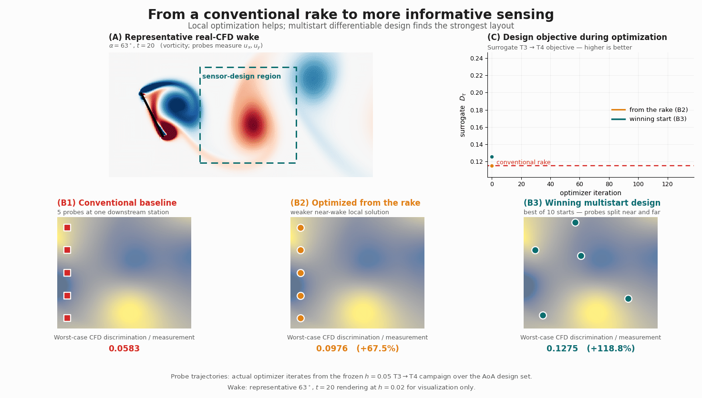
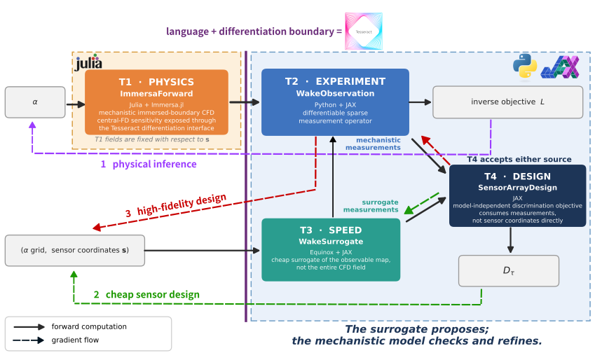
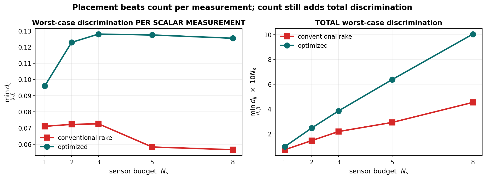
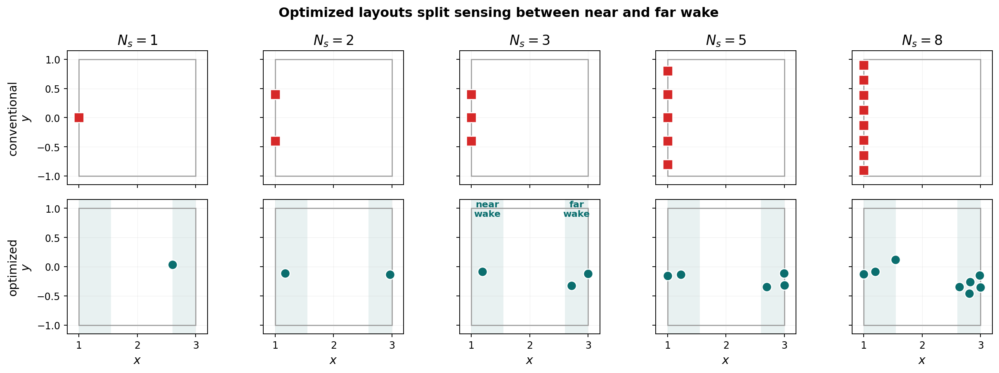
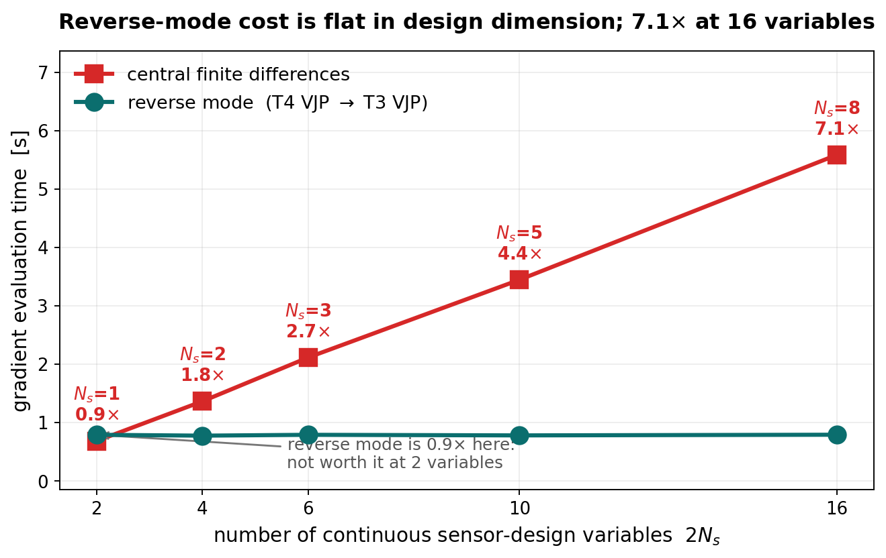

# Differentiable Sensor Design for Wake-Based Flow Inference

[](https://github.com/arturofburgos/immersa-tesseract-inference/actions/workflows/test.yaml)
[](LICENSE)

For questions, please contact me at [burgos3@illinois.edu](mailto:burgos3@illinois.edu)


> **Don't just add sensors. Put them where the physics is more informative.**

This project composes four Tesseracts [1] to infer the angle of attack (AoA) of a "hidden" flat plate from a small set of sparse wake probes, and then uses end-to-end gradients to decide *where those probes should be placed* so as to optimize the ability to identify the AoA. The workflow combines immersed-boundary CFD in Julia with a differentiable JAX chain for measurement, surrogate and experimental design.

<p align="center">
  
</p>

<p align="center"><em><strong>Figure 1.</strong> Probe trajectories come from the frozen T3→T4 campaign at mesh refinement of <code>h = 0.05</code>; the α = 63° wake is rendered at <code>h = 0.02</code> for visualization only. Panel A animates the wake over the full simulation, while the optimizer panels advance through optimization iterations on an independent normalized timeline; the two are not synchronized.</em></p>

---

## Key contributions

- **Hidden-parameter inference from sparse wake data.** A flat plate's unknown angle of attack is recovered from a handful of point probes in its wake, through a composed Julia-CFD-to-JAX chain rather than a single monolithic solver.
- **Probe placement as a differentiable design variable.** Sensor coordinates are continuous and the whole measurement chain is differentiable with respect to them, so end-to-end gradients optimize *where to measure*, not just what to infer.
- **Heterogeneous differentiable composition across language and differentiation boundaries.** A Julia immersed-boundary solver that differentiates by finite differences and a Python/JAX stack that uses automatic differentiation take part in one gradient chain, without sharing a language, cost scale, or differentiation strategy.
- **Cheap surrogate search, mechanistic verification.** A coordinate-based surrogate makes the design search affordable, while the mechanistic CFD route evaluates the proposed layouts on real CFD fields and further refines the selected design.

Full methodology, additional validation, limitations, and future research directions are covered in the accompanying technical write-up.

## Table of Contents

- [The scientific problem](#the-scientific-problem)
- [Project framework](#project-framework)
  - [Why Tesseract?](#why-tesseract)
- [Results](#results)
  - [Result 1 — Placement makes each measurement more informative](#result-1--optimized-placement-makes-each-measurement-more-informative)
  - [Result 2 — Optimized sensing improves hidden-AoA recovery](#result-2--optimized-sensing-improves-hidden-aoa-recovery)
  - [Result 3 — Reverse-mode gradients scale](#result-3--reverse-mode-gradients-scale-with-the-sensor-design-problem)
- [Quick start](#quick-start)
- [Reproducibility](#reproducibility)
  - [Reproducing results and figures](#reproducing-results-and-figures)
  - [Testing and CI](#testing-and-ci)
- [Engineering notes — Tesseract with a minutes-per-call solver](#engineering-notes--tesseract-with-a-minutes-per-call-solver)
- [Repository layout](#repository-layout)
- [References](#references)
- [Track and license](#track-and-license)

---

## The scientific problem

A thin flat plate sits at a fixed, unknown angle of attack `α` in a flow at Reynolds number Re = 200, simulated to a final time of 20 s. Depending on the AoA, the plate sheds a vortex wake, as seen in panel (A) of Figure 1. Downstream, point probes record the velocities `ux, uy` at five instants `t ∈ [12.0, 13.3, 15.1, 17.4, 20.0]`. The flow is simulated with [Immersa.jl](https://github.com/NUFgroup/Immersa.jl), a Julia CFD solver based on the Immersed Boundary Method [2] for fluid–structure interaction problems.

Related work has shown that sparse measurements in separated flat-plate flows can be used to estimate the underlying flow state through learned nonlinear maps [3]. Here, rather than reconstructing the flow field, two questions serve as motivation:

1. **Can sparse wake measurements recover a hidden AoA?**
2. **Can the probe locations be optimized directly with gradients to better distinguish different AoAs?**

The difficulty lies in aliasing: different plate angles can produce nearly indistinguishable wakes at a suboptimally chosen probe location. The inverse objective then develops spurious local minima, and a solver started on the wrong side can converge confidently to the wrong angle. Here the truth angle is **63°**, and across the AoA range examined the most dangerous alias is the pair [**63°**, **83°**]: the two produce nearly identical probe measurements, so the inverse objective develops a local minimum near 83° that is far deeper than any other.

The natural reflex would be to simply add more probes, for example, forming a denser cross-stream distribution at a single downstream coordinate in x, as seen in panel (B1). However, panel (B2) shows that once optimized, such an array only samples the same structures more densely (near-body wake), instead of observing different regions. Indeed, increasing the number of aligned probes does not necessarily lead to greater discrimination per measurement, since additional measurements in the same region can become redundant. The sensor coordinates, on the other hand, are continuous variables, and the entire measurement chain is differentiable with respect to them. This makes it possible to use gradients not only to infer the AoA, but also to design the experiment itself, determining where the probes should be placed to make different AoAs more distinguishable, as pictured in panel (B3).

There is also a computational difficulty. The mechanistic model is `Immersa.jl`, while the observation, the surrogate and the sensor design are naturally implemented with JAX. Moreover, these components operate at very different cost scales and do not use the same differentiation strategy.

The challenge, therefore, is not only to solve the inverse problem or to optimize the probe positions. It is to build a workflow in which these heterogeneous pieces can take part in a single differentiable chain, while preserving their natural implementations.

---

## Project framework

<p align="center">
  
</p>

<p align="center"><em><strong>Figure 2.</strong> The four Tesseracts and the language and differentiation boundary they span: T1 in Julia with finite-difference sensitivity, T2–T4 in Python/JAX/Equinox with automatic differentiation. The three numbered routes are physical inference, high-fidelity design, and cheap surrogate design.</em></p>

The framework is composed of four Tesseracts. `ImmersaForward` (T1) solves the flow physics; `WakeObservation` (T2) samples the dense CFD fields at sparse probe locations; `WakeSurrogate` (T3) provides a fast differentiable approximation of the measurements; and `SensorArrayDesign` (T4) evaluates sensor-layout discrimination.

|        | Component                                                           | Role       | Maps                                           | Stack              | Differentiation            |
| :----- | :------------------------------------------------------------------ | :--------- | :--------------------------------------------- | :----------------- | :------------------------- |
| **T1** | [`immersa_forward`](components/tesseracts/immersa_forward/)         | Physics    | `α` → dense fields `ux(x,y,t), uy(x,y,t)`      | Julia + Immersa.jl | Central differences in AoA |
| **T2** | [`wake_observation`](components/tesseracts/wake_observation/)       | Experiment | dense fields + sensors `s` → sparse `ux, uy`   | Python + JAX       | JAX AD                     |
| **T3** | [`wake_surrogate`](components/tesseracts/wake_surrogate/)           | Speed      | `(α,x,y)` → `ux, uy` at five observation times | Equinox + JAX      | JAX AD                     |
| **T4** | [`sensor_array_design`](components/tesseracts/sensor_array_design/) | Design     | measurement batch → discrimination `D_τ`       | JAX                | JAX AD                     |

The project contains two different optimization problems. In **inverse inference**, the probe locations are fixed and the optimizer changes the candidate AoA `α` until the predicted measurements match the observations. In **sensor design**, the candidate AoAs are fixed and the optimizer changes the probe coordinates `s`; T4 supplies the discrimination objective `D_τ` that tells the optimizer how informative each layout is.

The project therefore does not use a single chain `T1 → T2 → T3 → T4`. Instead, it uses three routes for three different purposes.

**Physical inverse-inference route — `T1 → T2 → inverse optimizer`.** T1 computes the CFD field for a candidate AoA, T2 samples it at the fixed probe locations, and the inverse optimizer updates `α` by comparing those measurements with the observations.

**Cheap sensor-design route — `T3 → T4`.** Sensor optimization requires evaluating many layouts across all candidate AoAs, which is too expensive to do with CFD in the loop. T3 therefore approximates the observable map represented by `T1 → T2`, and T4 scores how well the resulting measurements separate different AoAs. One objective-and-gradient evaluation over all candidate angles takes under a second, compared with roughly an hour to generate the corresponding fields with T1, making multistart gradient optimization practical.

Conceptually, `T3 ≈ T2 ∘ T1` only for the observable map needed for sensor design, not for the full CFD state. Its training data were generated by the actual `T1 → T2` route, so `T3` is a learned accelerator of the mechanistic measurement pipeline rather than an independent model.

**High-fidelity sensor-design route — `T1 → T2 → T4`.** The surrogate-selected layout is returned to the mechanistic route and scored with the identical `T4` objective on real CFD fields. Because the probes are passive, moving them does not change the flow, so persisted `T1` fields can be resampled by `T2` at new positions without rerunning CFD. The sensor-position gradient therefore acts through `T2 → T4` alone, allowing the surrogate proposal to be refined directly on the mechanistic objective.

The two design routes meet at the same **measurement-batch interface**: `T1 → T2` and `T3` produce the same type of observable, so `T4` can score either one without knowing how the measurements were generated.

Together, the routes form one workflow: `T1 → T2` defines the physical observable problem and supplies the data used to train `T3`; `T3 → T4` makes large-scale sensor search affordable; `T1 → T2 → T4` evaluates and refines the result on real CFD; and `T1 → T2 → inverse optimizer` tests whether the designed measurements improve hidden-AoA recovery.


### Why Tesseract?

The three routes above rely on the same core idea: components implemented in different ecosystems can be composed through a common differentiable interface. That matters here because the boundary is a genuine one. `ImmersaForward` wraps an existing mechanistic Immersa.jl CFD solver written in Julia, while the observation, surrogate, and sensor-design components are implemented in Python/JAX. The two sides differ in language, dependencies, computational cost, and differentiation strategy: T1 exposes AoA sensitivities through finite differences, whereas T2–T4 differentiate by automatic differentiation.

Without Tesseract, simply calling Julia from Python would solve only the forward-execution problem. The application would still need custom machinery to transport CFD outputs, request and interpret Julia-side sensitivities, compose those sensitivities with downstream JAX derivatives, and maintain that derivative plumbing as either side changed. An alternative would be to reimplement part of the workflow in the other ecosystem, coupling scientific software that is otherwise naturally independent.

Tesseract moves those concerns into the component boundary. Each Tesseract keeps its native language and differentiation strategy while exposing a common differentiable interface. In the physical inference route, `ImmersaForward` owns `∂(ux, uy)/∂α`, currently computed internally by central differences, while `WakeObservation` contributes the downstream JAX derivative needed by the inverse optimizer. The application composes those interfaces without needing to know how either derivative was implemented. A future tangent-linear or adjoint implementation could therefore replace the finite-difference sensitivity inside T1 without changing the downstream workflow.

The same interface also makes the mechanistic and surrogate design routes interchangeable at the observable level. `T1 → T2` produces physical sparse measurements, while T3 approximates that same measurement map; both can feed the identical T4 design objective. T4 therefore does not need separate logic for “CFD measurements” and “surrogate measurements”: switching between cheap search and high-fidelity evaluation is a change in composition rather than a rewrite.

Tesseract is therefore doing more than containerizing four pieces of code. It provides the differentiable contract that lets existing Julia physics, finite-difference sensitivities, JAX automatic differentiation, and a learned accelerator participate in one inference-and-design workflow while remaining independently replaceable.


---

## Results

### Result 1 — Optimized placement makes each measurement more informative

*Gradients move the probe coordinates; this section asks whether that produces a measurably better sensor layout on real CFD.*

**How a layout is scored.** For a fixed sensor layout, every candidate AoA produces its own vector of probe measurements. The *worst-case discrimination* is the distance between the hardest-to-distinguish pair of sufficiently separated angles, so a larger value means that even the most similar candidate wakes are easier to tell apart. Dividing by the number of measured scalar values gives the **per-scalar-measurement** version, which lets layouts with different sensor budgets be compared fairly. **Real-CFD** means those measurements are sampled from Immersa.jl fields rather than generated by T3: the surrogate is used to search for layouts, never to score them here.

**The 79-case CFD bank.** For physical evaluation, a bank of 79 Immersa.jl solutions was precomputed across the AoA range. Reported discrimination metrics are evaluated on the **66-AoA evaluation grid** — the 1° stations from 20° to 85° — sampled from that bank; the remaining 13 are the half-degree stations of a coarser 2.5° design grid used in an earlier campaign, retained so that campaign can be replayed from the same bank. Because the probes are passive, those same persisted flow fields can be sampled through T2 at any candidate sensor positions, so conventional and optimized layouts are evaluated on exactly the same physical data without rerunning CFD for every sensor movement.


For each sensor budget `Ns = 1, 2, 3, 5, 8`, the differentiable T3 → T4 objective is optimized from 10 initial layouts
and the best final layout is frozen before any mechanistic evaluation. The multistart search reduces sensitivity to local optima in a nonconvex design space, where local optimization started from the conventional rake can remain in an inferior configuration concentrated in the near wake. The frozen layout and the conventional baseline are then scored on the same 66-AoA evaluation grid drawn from the 79-case CFD bank; no new CFD was run for this comparison.


<p align="center">
  
</p>

<p align="center"><em><strong>Figure 3.</strong> Real-CFD worst-case discrimination per scalar measurement (left) and in total (right), for conventional and optimized layouts at every tested sensor budget.</em></p>

**Optimized placement improves real-CFD worst-case discrimination per scalar measurement by 35–122 % across every tested budget.** The left panel shows why: the optimized curve rises and then holds, while the conventional one falls away beyond three probes, as additional aligned measurements become increasingly redundant. The gap is wide enough that a single optimized probe already delivers more discrimination per measurement than eight aligned ones. The right panel is the necessary counterweight — measured in **total** rather than per measurement, both families keep climbing with budget, and a large conventional array still ends up ahead of one optimized probe. Placement drives discrimination efficiency per measurement; additional well-placed probes still increase total information.

<p align="center">
  
</p>

<p align="center"><em><strong>Figure 4.</strong> Optimized layouts for each budget. As the budget grows, probes occupy both a near-wake and a far-wake region rather than densifying one cross-stream rake.</em></p>

The corresponding optimized layouts show what the optimizer does geometrically: they do not simply densify one cross-stream rake. With larger budgets, sensors consistently occupy both a near-wake region (`x ≈ 1.0–1.5`) and a far-wake region (`x ≈ 2.6–3.0`). This pattern is consistent with distinct wake regions carrying complementary information — an interpretation, not a demonstrated physical mechanism.

**Refining on the mechanistic model.** The cheap `T3 → T4` search selects a strong candidate, which is then refined directly on the mechanistic objective. Re-optimizing the *identical* `T4` objective on persisted real `T1` fields sampled through `T2` improves every reported real-CFD metric. Because the probes are passive, no CFD is rerun as they move: the sensor-position gradient is taken through `T2 → T4` alone.

| Real-CFD metric (two probes) | Conventional | Surrogate-designed |  CFD-refined |
| :--------------------------- | -----------: | -----------------: | -----------: |
| Discrimination `D_τ`         |     0.150870 |           0.211853 | **0.228563** |
| Physical hard minimum        |     0.072244 |           0.122922 | **0.153704** |
| 63°–83° pair distance        |     0.095632 |           0.176681 | **0.188117** |

Against the conventional array the refined design gains **+51.5 %**, **+112.8 %** and **+96.7 %** on those three metrics. More informative is the gain over the already-strong surrogate proposal: **+7.9 %**, **+25.0 %** and **+6.5 %**. The coordinates move only modestly — about `0.13` within the design box — yet the physical hard minimum, which is set by the hardest-to-separate AoA pair, improves by a quarter. The mechanistic route is therefore not a consistency check on the surrogate; it changes the final design.

> **The surrogate searches efficiently; the mechanistic model closes the loop and improves the final physical design.**


### Result 2 — Optimized sensing improves hidden-AoA recovery

*Better discrimination is only worth having if it changes the inverse problem the project set out to solve.*

Discrimination is a proxy; the ultimate goal is to recover the hidden angle. The cross-language `T1 → T2` inverse workflow recovers a hidden truth of 63° from an initial guess of 55° as **63.000018° in 5 iterations**, demonstrating the physical AoA-inference route end to end across the Julia/JAX boundary.

The harder question is whether optimized sensor placement makes that recovery more robust across different initial guesses.

<p align="center">
  
</p>

<p align="center"><em><strong>Figure 5.</strong> Matched eight-probe comparison: multistart AoA recovery from ten initial guesses (left) and the corresponding real-CFD inverse landscape (right), for the conventional rake and the optimized array.</em></p>

At the same eight-probe budget (left), the conventional rake recovers the correct AoA from **7/10** initial guesses, while the optimized array succeeds from **8/10**. The improvement is modest — one additional successful trajectory — but it occurs without adding sensors. In particular, `α₀ = 40°` converges to a false solution near 50.707° with the conventional rake, while the optimized array recovers **63.000108°**.

The inverse landscape (right) provides a complementary view of identifiability. The strongest false minimum remains near 83° for both layouts, but optimized sensing raises its objective value from approximately 0.0375 to 0.0877, increasing the true-to-best-false margin by **2.341×**. This does not by itself explain the rescued 40° trajectory — the optimized landscape still contains local minima near 42° and 51° — rather, it shows stronger overall separation from the most dangerous false solution.

**63° lies on the design grid, so this is a diagnostic case rather than a held-out generalization assessment.**

### Result 3 — Reverse-mode gradients scale with the sensor-design problem

*Every optimized layout above was found by gradient search; this section asks what that gradient costs as the design grows.*

<p align="center">
  
</p>

<p align="center"><em><strong>Figure 6.</strong> Gradient evaluation time against the number of continuous sensor-design variables. Coordinate-wise central differences scale with the design dimension; the reverse-mode cost stays nearly constant across the tested range.</em></p>

A layout of `Ns` probes gives `2Ns` continuous design variables. Coordinate-wise central differences require `2 × 2Ns` objective evaluations, so their cost grows with the number of sensor coordinates, while the reverse-mode chain `T4 VJP → T3 VJP` requires a single reverse-mode gradient evaluation whose measured cost remains nearly constant across the tested range. **Reverse mode offers no advantage for the smallest design problem, but reaches a 7.1× speedup over central differences at 16 continuous design variables (`Ns = 8`) — 0.79 s against 5.58 s.** This benchmark times the fast T3 → T4 design path; it does not differentiate a new mechanistic CFD simulation.

Additional held-out validation, failure cases, limitations, and future directions are discussed in the accompanying technical write-up.

---

## Quick start

**Prerequisites:** [Tesseract Core](https://github.com/pasteurlabs/tesseract-core) and a running Docker daemon, as each component builds and runs as a container. Linux and macOS; on Windows use [WSL2](https://learn.microsoft.com/windows/wsl/).

```bash
git clone https://github.com/arturofburgos/immersa-tesseract-inference.git
cd immersa-tesseract-inference

python -m venv .venv && source .venv/bin/activate
pip install -r app/requirements.txt      # tesseract-core==1.11.0
pip install -e "app[dev]"

make build                               # builds all four Tesseracts
```

`make build` is the slowest step: the T1 image installs a pinned version of Julia and Immersa.jl (~4.6 GB); the three JAX images are roughly ~1.2 GB each. To build a single component, use `make build wake_surrogate`.

Verification comes at three levels, cheapest first: **fastest result check** replots the reported figures from committed artifacts (seconds, no containers); **quick verification** exercises the real containers and composed gradients (minutes, once `make build` has finished); **full reproduction** rebuilds the CFD data and reruns the campaigns (hours).

### Fastest result check — seconds, no CFD, no containers

Every reported metric is committed as JSON/CSV under [results/](results/), and the four static README figures are rebuilt from those frozen artifacts alone:

```bash
python scripts/budget_ablation/plot_readme_figures.py                    # Figures 3, 4, 6
python scripts/budget_ablation/plot_readme_ns8_recovery_and_landscape.py # Figure 5
```

Both scripts only read committed CSV/JSON. They do **not** rerun the optimization campaigns, do **not** touch the CFD bank, and do **not** start any container. This is the quickest way to confirm that the numbers in the results sections come from the stored artifacts. Figure 1 is the one exception: it has extra dependencies, listed under [Reproducing results and figures](#reproducing-results-and-figures).

### Quick verification — minutes after build, no production CFD

```bash
make test        # 9 component regression fixtures + 14 app tests; exactly what CI runs
```

Straight to the parts that matter most:

```bash
# Composed T3 -> T4 gradient compared against central differences, through the real containers
pytest app/tests/test_sensor_design.py::test_composed_sensor_gradient_matches_finite_differences -s

# T1's Julia-side AoA Jacobian compared against the application-level finite difference
pytest app/tests/test_angle_jacobian.py::test_t1_jacobian_matches_app_finite_difference -s

# T1 -> T2 end to end: coarse CFD solve sampled at sparse probes
pytest app/tests/test_pipeline.py -s

# Immersa.jl's own Julia testset inside the built T1 image
make test-immersa
```

The first two print the analytic-versus-finite-difference comparison coordinate by coordinate.

### Full reproduction — hours, and requires CFD

The 79-case CFD bank is **not committed** (`data/` is in `.gitignore`). The surrogate weights **are** committed, so anything that depends only on T3 works from a fresh clone. For everything else there are two options.

**Download the precomputed bank** (recommended, ~51 MB) from the [`data-v1` release](https://github.com/arturofburgos/immersa-tesseract-inference/releases/tag/data-v1), unpacking from the repository root:

```bash
curl -LO https://github.com/arturofburgos/immersa-tesseract-inference/releases/download/data-v1/cfd_validation_bank.tar.gz
curl -LO https://github.com/arturofburgos/immersa-tesseract-inference/releases/download/data-v1/cfd_holdout_bank.tar.gz
curl -LO https://github.com/arturofburgos/immersa-tesseract-inference/releases/download/data-v1/SHA256SUMS
sha256sum -c SHA256SUMS

tar -xzf cfd_validation_bank.tar.gz   # -> data/cfd_validation_bank/
tar -xzf cfd_holdout_bank.tar.gz      # -> data/cfd_holdout_bank/
```

This matters for more than disk space: rebuilding the bank requires the T1 image, which installs a pinned Julia and Immersa.jl (~4.6 GB) and is by far the slowest setup step. With the bank in place, every campaign marked `bank` but not `T1` in the table below runs on the three JAX components alone, so building just those three (`make build wake_observation`, then `wake_surrogate`, then `sensor_array_design`) is enough and the Julia toolchain can be skipped entirely.

**Or rebuild it from scratch** — 79 fresh solves, roughly 51 MB on disk:

```bash
python scripts/physical_validation/build_cfd_bank.py     # 79 solves -> data/cfd_validation_bank/
python scripts/final_validation/build_holdout_truths.py  # 3 sealed solves -> data/cfd_holdout_bank/
```

Production settings used throughout this work: `h = 0.05`, `dt = 0.0025`, `tf = 20.0`, `Re = 200`, `snapshot_freq = 40`, observation times `[12.0, 13.3, 15.1, 17.4, 20.0]`.

**Judges do not need to rerun any of these campaigns.** Every quoted metric is committed as JSON/CSV under [results/](results/), and every README figure except Figure 1 regenerates from those tracked artifacts alone.

---

## Reproducibility

### Reproducing results and figures

The campaigns below reproduce the reported metrics and write frozen artifacts under [results/](results/). `T1` means new CFD solves; `bank` means the persisted 79-case CFD bank is sampled but no new CFD is run. Reported discrimination metrics are computed on the 66-angle 1° evaluation grid within that bank.

| Result | Command | Needs | Writes under `results/` |
| :-- | :-- | :-- | :-- |
| Hidden-AoA recovery (`T1 → T2`) | `python scripts/tesseract_gradient_inference/run_t1_t2_gradient_inference.py` | T1, T2 | `tesseract_gradient_inference/t1_t2_gradient_inference.csv`, `sensitivity_comparison.csv` |
| Phase-I physical transfer | `python scripts/physical_validation/validate_physical_transfer.py` | T2, T4, bank | `sensor_design/physical_validation/physical_transfer_metrics.json` |
| Phase-II surrogate design campaign | `python scripts/refined_design/run_refined_surrogate_campaign.py` | T3, T4 | `sensor_design/refined_design/surrogate_v2/s_star_surrogate_v2.json`, `multistart_summary_v2.csv` |
| Phase-III mechanistic refinement | `python scripts/refined_design/run_physical_refinement.py` | T2, T4, bank | `sensor_design/refined_design/physical_refinement/s_star_cfd_refined.json`, `physical_refinement_metrics.json`, `physical_benchmark.json` |
| Budget ablation + gradient benchmark | `python scripts/budget_ablation/run_budget_ablation.py` | T3, T4 | `sensor_budget_ablation/budget_ablation{.csv,_summary.json}`, `gradient_scaling.csv` |
| Matched `Ns=8` multistart recovery | `python scripts/budget_ablation/run_ns8_multistart_recovery.py` | T1, T2, bank | `sensor_budget_ablation/ns8_multistart_{recovery.csv,summary.json}` |
| Matched `Ns=8` inverse landscape | `python scripts/budget_ablation/run_ns8_inverse_landscape.py` | T2, bank | `sensor_budget_ablation/ns8_inverse_landscape{.csv,_metrics.json}` |
| Held-out landscapes (33.5 / 58.5 / 74.5°) | `python scripts/final_validation/run_holdout_landscapes.py` | T2, bank | `sensor_design/final_physical_validation/holdout_landscape_{33.5,58.5,74.5}.csv`, `holdout_landscape_metrics.json` |

The four README figures below regenerate from tracked artifacts alone — no containers, no CFD bank:

| Figure | Command |
| :-- | :-- |
| Figures 3, 4 and 6 | `python scripts/budget_ablation/plot_readme_figures.py` |
| Figure 5 — matched `Ns=8` recovery + landscape | `python scripts/budget_ablation/plot_readme_ns8_recovery_and_landscape.py` |

Figure 1 is the exception. `python scripts/budget_ablation/plot_hero_multistart_story.py` additionally needs the presentation-only wake field `data/hero_visualization_alpha063_h002.npz` (**gitignored**; download from the [`data-v1` release](https://github.com/arturofburgos/immersa-tesseract-inference/releases/download/data-v1/hero_visualization_alpha063_h002.npz) or rebuild with `build_hero_visualization_field.py`), the two `Ns=5` optimizer-iterate replays `ns5_{optimization,naive_start}_replay.json`, and the cached objective histories `ns5_objective_histories.json`. If that cache is absent, it is recomputed using the built Tesseract containers. Both replays reproduce the frozen campaign exactly; the winner lands on `Ns5_optimized` bit-for-bit.

Supporting figures for the technical write-up come from `plot_readme_heldout.py` (held-out summary) and the other `plot_*.py` scripts in the same campaign directories. Plotting scripts read frozen artifacts and hard-code no scientific values.

### Testing and CI

`make test` runs **9 Tesseract regression fixtures** — JSON with per-output `atol`/`rtol`, via `tesseract run <image> test` — plus **14 pytest tests** in `app/`, all exercising the real containers. CI ([`.github/workflows/test.yaml`](.github/workflows/test.yaml)) builds all four components and runs the same target on Python 3.10 and 3.14; a second workflow runs `pre-commit` (ruff lint + format, file hygiene). Capture a new fixture with `make gen-tests <component> FILE=payload.json`.

The versions below are pinned because the `.eqx` weights are deserialized against them; an unpinned resolve could silently shift every prediction:

| Layer | Pin |
| :-- | :-- |
| Immersa.jl | commit `62810dcff9418d6fface55dd34b5f1b914ffa743` |
| Julia (T1 image) | 1.11.9 |
| T2 / T3 / T4 runtime | Python 3.11.2 · JAX 0.10.2 · jaxlib 0.10.2 · Equinox 0.13.8 |
| Application | `tesseract-core==1.11.0` |

JAX x64 is deliberately not enabled: T2, T3 and T4 run in float32, which caps composed-gradient agreement at roughly `1e-5` relative and is accounted for in every tolerance above.

**Benchmark environment (Result 3).** The 0.79 s / 5.58 s gradient timings were measured through the pinned T3/T4 containers above, which install the CPU-only `jax[cpu]==0.10.2` build, no GPU is used. The host CPU and OS were not recorded alongside the frozen `gradient_scaling.csv`. Absolute timings are therefore machine-dependent; the reported 7.1× comparison was measured on the same machine for both methods, in a single run.

## Engineering notes — Tesseract with a minutes-per-call solver

`tesseract-core` is used unmodified at the pinned 1.11.0 release; nothing here is a fork. Composing a Julia CFD solver with JAX components did expose boundary-level constraints, and working around them shaped the design of this project.

**Reusing expensive component outputs.** A single `T1.apply` at production settings takes about 53 s. Scoring one candidate sensor layout over the 66-AoA evaluation grid would therefore cost roughly 58 minutes of live CFD, and the design optimizer needs 142 such evaluations — on the order of 5.7 days of serial CFD for a single optimization run. Because the probes are passive, sensor position is not an input to `T1` and the flow state does not depend on it. `T1` is therefore solved once per angle of attack and the fields are persisted; any candidate layout is scored by replaying those fields through `T2.apply`, taking the sensor-position gradient through `T4 VJP → T2 VJP` alone. The mechanistic design loop then runs with no new CFD at all. Tesseract's experimental VJP cache does not cover this case — it is local to JAX recipes, and `T1` imports no JAX — so this was reported upstream as [tesseract-core#711](https://github.com/pasteurlabs/tesseract-core/issues/711).

**Derivative endpoints discard reusable work.** `T1.jacobian` forms its central difference internally, so the two full CFD solutions it computes are discarded at the container boundary. The application-level route that calls `apply` twice produces the same derivative to `3.55e-07` relative while keeping both fields: the more Tesseract-native composition is the one that throws away more reusable work. Both routes are implemented and selected per study, which is what made the comparison measurable in the first place.

**float32 regression fixtures are not bit-portable.** The `T3` fixtures failed CI on a different machine. The cause was traced to instruction-set-dependent XLA float32 results rather than dependency drift, and the fixtures now carry `atol = rtol = 1e-5`; the framework default `atol = 1e-8` is a float64-scale tolerance applied regardless of output dtype.

**T1 exposes no `abstract_eval`.** Immersa's output grid is solver-determined — `h = 0.05` yields `(141, 60)` and `h = 0.02` yields `(353, 152)`, which no simple function of `h` predicts — so `T1` provides the explicit Jacobian/JVP interface rather than claiming to be statically traceable.

## Repository layout

```text
immersa-tesseract-inference/
├── components/
│   ├── tesseracts/
│   │   ├── immersa_forward/          # T1: Julia/Immersa.jl physics
│   │   ├── wake_observation/         # T2: sparse probe sampling
│   │   ├── wake_surrogate/           # T3: differentiable observable surrogate
│   │   └── sensor_array_design/      # T4: sensor-discrimination objective
│   └── shared_code/                  # code shared across Tesseract images
│
├── app/                              # composed workflows, inverse solver, and tests
├── scripts/                          # experiment, validation, and plotting campaigns
├── models/wake_surrogate/            # frozen surrogate weights + normalization
├── results/                          # committed metrics, provenance, and figures
├── data/                             # rebuildable CFD banks and datasets (gitignored)
├── .github/workflows/                # CI and pre-commit checks
├── Makefile                          # build, test, and component utilities
└── README.md
```

---

## References

[1] Häfner, D., & Lavin, A. (2025). *Tesseract Core: Universal, autodiff-native software components for Simulation Intelligence.* Journal of Open Source Software, 10(111), 8385.

[2] Colonius, T., & Taira, K. (2008). *A fast immersed boundary method using a nullspace approach and multi-domain far-field boundary conditions.* Computer Methods in Applied Mechanics and Engineering, 197(25–28), 2131–2146.

[3] Nair, N. J., & Goza, A. (2020). *Leveraging reduced-order models for state estimation using deep learning.* Journal of Fluid Mechanics, 897, R1.

---

## Track and license

**Track 04 — Differentiable inference / UQ.** An expensive solver wrapped as a Tesseract and dropped into an inverse problem. The solver exposes its Jacobian by finite differences; the composition with the inference engine is the contribution.

Apache 2.0 — see [LICENSE](LICENSE). Built on [Tesseract Core](https://github.com/pasteurlabs/tesseract-core) and [Immersa.jl](https://github.com/NUFgroup/Immersa.jl).
