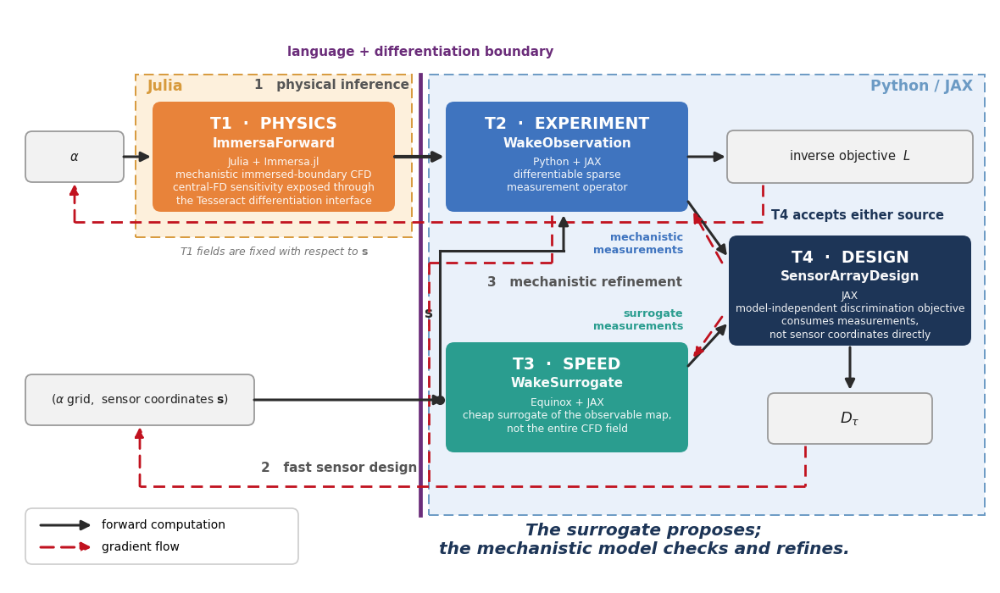
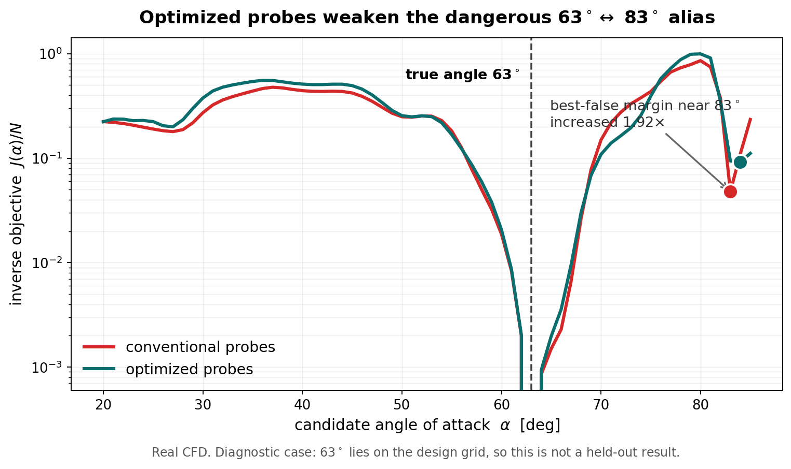
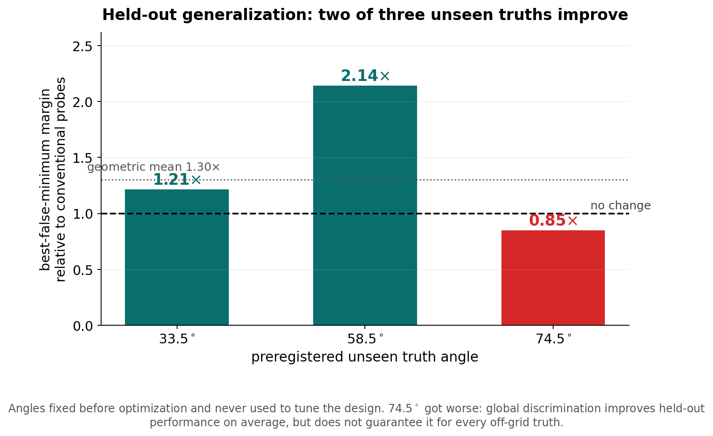

# Differentiable Sensor Design for Wake-Based Flow Inference

> **Don't just add sensors. Put them where the physics is informative.**

I present here a differentiable workflow composed of four Tesseracts. It first infers the angle of attack (AoA) of a "hidden" flat plate from a small set of sparse wake probes, and then uses end-to-end gradients to decide *where those probes should be placed* so as to maximize the ability to identify the angle of attack. The workflow combines immersed-boundary CFD in Julia with a differentiable JAX chain for measurement, surrogate and experimental design.

<p align="center">
  
</p>

<p align="center"><em>Local optimization improves the conventional rake, while differentiable design with multiple initializations finds a stronger configuration distributed between the near- and far-wake regions.<br>Probe trajectories come from the frozen T3→T4 campaign at <code>h = 0.05</code>; the α = 63°, t = 20 wake is rendered at <code>h = 0.02</code> for visualization only.</em></p>

---

## The scientific problem

A thin flat plate sits at a fixed, unknown angle of attack `α` in a Re = 200 flow. Depending on the AoA, a vortex wake is shed. Downstream, point probes record the velocities `ux, uy` at five instants. Two questions then arise:

1. **Can sparse wake measurements recover the hidden angle of attack?**
2. **And more importantly, can we place the probes so as to better distinguish different angles of attack?**

The difficulty lies in aliasing: different plate angles can produce nearly indistinguishable wakes at a badly chosen probe location. The inverse objective then develops spurious local minima, and a solver started on the wrong side can converge confidently to the wrong angle. Here, the worst alias occurs for the pair [**63°**, **83°**].

The conventional reflex would be to simply add more probes — for example, forming a denser cross-stream rake at a single downstream station in x. However, once optimized, such an array only samples the same structures more densely, instead of observing different regions of the wake, as seen in B2 above. Indeed, increasing the number of aligned probes does not necessarily lead to greater discrimination per measurement, since additional measurements in the same region can become redundant. The sensor coordinates, on the other hand, are continuous variables, and the entire measurement chain is differentiable with respect to them. This makes it possible to use gradients not only to infer the angle of attack, but also to design the experiment itself, determining where the probes should be placed to make different angles of attack more distinguishable.

There is also a computational difficulty. The mechanistic model is `Immersa.jl`, a CFD solver written in Julia, while the observation, the surrogate and the sensor design are naturally implemented with JAX. Moreover, these components operate at very different cost scales and do not use the same differentiation strategy.

The challenge, therefore, is not only to solve the inverse problem or to optimize the probe positions. It is to build a workflow in which these heterogeneous pieces can take part in a single differentiable chain, while preserving their natural implementations.

> **It is precisely this boundary that Tesseracts make it possible to cross.**

---

## Why Tesseract?

<p align="center">
  
</p>


The workflow crosses a real boundary and is composed of four Tesseracts, each responsible for a distinct stage of the inference and design chain. `ImmersaForward` (T1) solves the flow physics; `WakeObservation` (T2) turns the dense fields into sparse measurements at the probe positions; `WakeSurrogate` (T3) provides a cheap, differentiable approximation to those measurements; and `SensorArrayDesign` (T4) quantifies how well a given sensor configuration distinguishes different angles of attack.

|        | Component                                                            | Role        | Maps                                            | Stack              | Differentiation                                  |
| :----- | :------------------------------------------------------------------ | :---------- | :---------------------------------------------- | :----------------- | :----------------------------------------------- |
| **T1** | [`immersa_forward`](components/tesseracts/immersa_forward/)         | Physics     | `α →` dense fields `ux(x,y,t), uy(x,y,t)`       | Julia + Immersa.jl | Central differences in AoA, inside the component |
| **T2** | [`wake_observation`](components/tesseracts/wake_observation/)       | Experiment  | dense fields + sensors `s →` sparse `ux, uy`    | Python + JAX       | JAX AD                                           |
| **T3** | [`wake_surrogate`](components/tesseracts/wake_surrogate/)           | Speed       | `(α, x, y) → ux, uy` at the five instants       | Equinox + JAX      | JAX AD                                           |
| **T4** | [`sensor_array_design`](components/tesseracts/sensor_array_design/) | Design      | measurement batch `→` discrimination `D_τ`      | JAX                | JAX AD                                           |

This problem does not correspond to a single homogeneous chain `T1 → T2 → T3 → T4`. There are, in fact, two complementary computational paths. The first is the **high-fidelity mechanistic path**: `T1 → T2`. The Immersa.jl solver receives the angle of attack and produces the flow; then `WakeObservation` extracts from that field the measurements that the probes would record. The second is the **cheap design path**: `T3 → T4`. The surrogate reproduces only the observable map needed for sensor design, and `SensorArrayDesign` evaluates how well those measurements distinguish different angles of attack. The common interface is the measurements themselves. Both `T1 → T2` and `T3` produce the same kind of observable, allowing `T4` to score either one without knowing how those measurements were obtained.

This separation matters because the components are deeply heterogeneous: the physical solver is implemented in Julia, costs minutes per evaluation and uses finite differences for its AoA sensitivity. The observation, surrogate and design components, by contrast, are in Python/JAX, cost milliseconds and use automatic differentiation. Tesseract allows these components to be treated as differentiable parts of a single workflow without requiring them to share a language, an implementation or a differentiation strategy.

> **Tesseract makes the mechanistic and surrogate pathways interchangeable without forcing their implementations to be homogeneous.**

Each Tesseract declares its differentiable inputs and outputs and exposes derivative endpoints, allowing the application to compose gradients across those boundaries without needing to know how they were computed internally.

Two consequences of this architecture are particularly important:

* **The derivative with respect to AoA lives inside T1's differentiation boundary.** The application asks `ImmersaForward` for the quantity `∂(ux, uy)/∂α` and receives that derivative directly — it never forms the finite-difference quotient itself. In the future, a linearized or adjoint solver could replace that implementation without requiring changes to the other Tesseracts.

* **T4 does not directly receive the sensor coordinates.** It receives a *batch* of measurements corresponding to the different candidate angles. In this way, both the cheap surrogate-based path and the mechanistic path based on the full solver can feed exactly the same design component.

T3 approximates only the **observable map needed for experimental design**, never the full CFD state. T4's score is a soft minimum over pairwise measurement distances, normalized per scalar measurement so that different sensor budgets can be compared.

### Three composed workflows

**1 · Physical inverse inference** — `α → T1 → T2 → inverse optimizer`

The AoA sensitivity is requested from `ImmersaForward` and propagated through `WakeObservation`. Starting from a truth value of 63° and an initial estimate of 55°, the composed workflow recovers **63.000018°** in **5 iterations**, agreeing with the original in-application finite-difference implementation to `3.5e-7` relative. This is the evidence that gradients genuinely cross the Julia/JAX boundary; it is not the main scientific result.

**2 · Cheap differentiable sensor design** — `(α grid, s) → T3 → T4 → D_τ`, reverse mode

During the search for probe positions, running the CFD solver for every candidate layout would be prohibitively expensive. On this path, `WakeSurrogate` receives the candidate angles and the current probe coordinates `s` and directly produces the velocities `ux, uy` that would be observed at those points. `SensorArrayDesign` receives this measurement _batch_ and computes the scalar score `D_τ`, which measures how well the layout separates the different angles of attack. Since this entire chain is differentiable, the gradient of D_τ flows back in reverse mode through T4 and T3 to the probe coordinates, `T4 VJP → T3 VJP → ∂D_τ/∂s`

**3 · Mechanistic evaluation and refinement** — `s → T2[T1 fields] → T4`, reverse mode

Once the surrogate proposes a layout, the same positions can be evaluated directly on fields produced by the mechanistic solver. The `ImmersaForward` fields for the different angles are persisted; for a new layout `s`, `WakeObservation` simply samples those fields at the proposed positions and produces the same kind of measurement batch used by T4. `SensorArrayDesign` then computes exactly the same score `D_τ`.

Here, the gradient flows back through `T4` and the observation operation in `T2`, `T4 VJP → T2 sensor VJP → ∂D_τ/∂s`.

No derivative of T1 with respect to probe position is required: the probes are passive, so moving a probe does not change the flow. The entire dependence of `D_τ` on `s` arises at the moment `T2` samples the CFD fields. For this reason, the same persisted bank of mechanistic solutions can be reused to evaluate and refine different layouts without running a new simulation for every probe movement.

This third path closes the loop: *T3 lets you search quickly; T1 → T2 lets you check and refine using the mechanistic physics.*

---

## Result 1 — Placement beats naive sensing, per measurement


For each sensor budget, the differentiable T3 → T4 objective is optimized from 10 initial layouts — the conventional rake plus nine random initializations — and the best final design is frozen before any mechanistic evaluation. The multistart search reduces sensitivity to local optima in a nonconvex design space, in which local optimization started from the conventional rake can remain in an inferior configuration concentrated in the near-wake region. The selected layout and the conventional baseline are then scored on the same 66-angle real-CFD bank; no new CFD was run for this comparison.

| `Ns` | Conventional | Optimized | Gain per measurement | Conventional total | Optimized total |
| --: | --: | --: | --: | --: | --: |
| 1 | 0.071078 | 0.095964 | **+35.0 %** | 0.7108 | 0.9596 |
| 2 | 0.072244 | 0.122931 | **+70.2 %** | 1.4449 | 2.4586 |
| 3 | 0.072583 | 0.128025 | **+76.4 %** | 2.1775 | 3.8407 |
| 5 | 0.058272 | 0.127483 | **+118.8 %** | 2.9136 | 6.3742 |
| 8 | 0.056602 | 0.125480 | **+121.7 %** | 4.5282 | 10.0384 |

**Optimized placement improves real-CFD worst-case discrimination per scalar measurement by 35–122 % across every tested sensor budget**, and the advantage widens with budget as additional aligned measurements become increasingly redundant. Compactly: *one optimized probe provides about 70 % greater worst-case discrimination per measurement than eight naive probes.*

This qualifier matters. In terms of **total** discrimination, eight naive probes (4.5282) are well ahead of a single optimized probe (0.9596). Placement drives discrimination efficiency per measurement, while additional well-placed probes still increase total information.

---

## Result 2 — What the optimizer discovers


The optimized layouts are not simply a denser rake. As the budget grows, the probes are consistently distributed between a near-wake region (`x ≈ 1.0–1.5`) and a farther region (`x ≈ 2.6–3.0`), rather than densifying a single cross-stream station. This suggests that observing distinct regions of wake evolution is more discriminative than densely sampling a single cross-stream station — an interpretation consistent with the layouts, but not a demonstrated physical mechanism.

---

## Result 3 — Reverse-mode gradients scale better


| Design variables | Reverse mode | Central differences | Speedup |
| --: | --: | --: | --: |
| 2 | 0.79 s | 0.68 s | 0.9× |
| 4 | 0.77 s | 1.36 s | 1.8× |
| 6 | 0.79 s | 2.11 s | 2.7× |
| 10 | 0.78 s | 3.45 s | 4.4× |
| 16 | 0.79 s | 5.58 s | **7.1×** |

Coordinate-wise central differences require `2 × 2Ns` objective evaluations and scale with the dimension of the design space; the reverse-mode chain requires only one sweep, staying essentially constant, varying by less than 2 % across the whole tested range. **Reverse mode offers no advantage for the smallest design problem, but reaches a 7.1× speedup over central differences at 16 design variables.** This benchmark times the fast T3 → T4 design path; it does not differentiate a new mechanistic CFD simulation.

---

## Back to mechanistic CFD

A surrogate-optimized layout is a *proposal*. The question is whether that proposal survives contact with the mechanistic model.

**Phase I** used an AoA design grid with 2.5° spacing. The frozen design improved global real-CFD discrimination by +14.2 %, but barely changed the alias that actually breaks the inverse problem: the confusion between 63° and 83° is sharper than any pair adequately represented by the coarse grid, and so the criterion could not see it. The coarse design grid did not expose this failure mode, motivating the refinement to 1°.

**Phase II** refined only the AoA grid to 1° spacing over 20…85°. The CFD mesh, the T3 weights, the T4 mathematics, the bounds, the optimizer and the minimum sensor separation were left unchanged — no retraining and no new CFD. Evaluated on real CFD, the resulting two-probe design (`s*_surrogate_v2`) gives:

| Metric | Conventional | Refined design | Change |
| :-- | --: | --: | --: |
| Global discrimination `D_τ` | 0.150870 | 0.211853 | **+40.4 %** |
| Physical hard minimum | 0.072244 | 0.122922 | **+70.1 %** |
| Critical pair (63°, 83°) distance | 0.095632 | 0.176681 | **+84.8 %** |

**Phase III** used the same T4 objective with measurements coming from real CFD through T2, producing `s*_cfd_refined` with a genuine mechanistic gradient and no new CFD simulations. The design moved only modestly from V2.

> **The surrogate proposes; the mechanistic model checks and refines.**

---

## Inverse inference and aliasing



Truth value of 63°, with a dangerous alias near 83°. Mechanistic refinement raised the margin between the true minimum and the best false minimum by **1.918×** over the conventional array. Started deliberately on the wrong side at 80°, the conventional and V2 layouts converge to 83.22° and 83.36° respectively; the CFD-refined layout recovers 63.00021°. Across the ten committed initializations, successful recoveries go 7/10 → 7/10 → 8/10, and the mechanistically refined layout removes the 83° basin from those trajectories. This should be read as supporting evidence: it amounts to just one additional successful trajectory. **63° lies on the Phase-II design grid, so this is a diagnostic case and not a held-out generalization assessment.**

A matched test at a larger budget shows the same behavior. Holding a fixed eight-probe budget, optimized placement modestly broadened multistart recovery from 7/10 to 8/10 — rescuing `α₀ = 40°`, which the rake sends to a false basin near 51° — but did not reduce convergence effort once both layouts entered the correct basin: the median was 5 iterations and 15 T1 evaluations for both.

---

## Held-out evaluation



Three truth angles — **33.5°, 58.5°, 74.5°** — were preregistered in [phase2_preregistration.json](results/sensor_design/refined_design/phase2_preregistration.json) before any Phase-II optimization, and verified to be absent from T3 training and validation, from the 1° design grid, from the existing CFD bank and from every earlier physical result. Only afterwards were they solved with CFD for the first time. No design was modified in response to the results.

| Held-out truth | Margin factor vs conventional | Outcome |
| :-- | --: | :-- |
| 33.5° | 1.213× | improved |
| 58.5° | 2.144× | improved |
| **74.5°** | **0.849×** | **worsened** |
| Geometric mean | **≈ 1.30×** | 2 of 3 improve |

**The 74.5° case got worse, and it is reported because it happened.** Finite-grid sensor optimization improved held-out discrimination on average, but not uniformly. The global minimum still coincides with the true angle in all three held-out cases for every layout; the degradation is in the margin to the best false minimum, not in the recovered answer.

---

## Limitations

1. Optimizing discrimination on a **finite AoA grid** does not guarantee continuous or off-grid optimality; held-out margins improve in the geometric mean, but not uniformly.
2. One of the three preregistered held-out cases (**74.5°**) worsened, and three sealed angles is still a small sample.
3. The multistart recovery improvement is **modest** — one additional trajectory in ten, at two budgets.
4. The claim "one optimized probe versus eight naive probes" holds only **per scalar measurement**, not in terms of total discrimination.
5. T2 uses piecewise multilinear interpolation, so the physical objective with respect to sensor positions is **piecewise smooth** rather than globally `C¹`; gradient checks are excellent away from interpolation knots.
6. T3 captures useful **gradient directions** — median cosine ≈ 0.96 against real CFD — better than exact magnitudes, which show ≈ 29 % error. This is precisely why the mechanistic T1 → T2 → T4 path remains necessary.
7. The study considers a **single physical regime**: one plate geometry, `Re = 200`, five fixed observation times, two velocity components, and a `[1, 3] × [−1, 1]` design box.

---

## Future work

**Toward globally identifiable sensing.** The present objective optimizes discrimination between measurements, rather than the basin geometry of the downstream inverse problem. In the 63° diagnostic, optimized layouts modestly broadened successful recovery from 7/10 to 8/10 initializations while leaving median convergence effort unchanged. A natural next step is to design measurements directly for global recoverability — through continuous alias-aware objectives, basin-aware margins, differentiation through the inverse solver itself, adaptive sensing, or joint space–time sensor design.

Beyond that: richer geometries and multi-parameter inference; native linearized or adjoint Immersa sensitivities behind T1's existing derivative endpoints; and larger arrays with richer observables.

---

## Quick start

**Prerequisites:** [Tesseract Core](https://github.com/pasteurlabs/tesseract-core) and a running Docker daemon — each component builds and runs as a container. Linux and macOS; on Windows use [WSL2](https://learn.microsoft.com/windows/wsl/).

```bash
git clone https://github.com/arturofburgos/immersa-tesseract-inference.git
cd immersa-tesseract-inference

python -m venv .venv && source .venv/bin/activate
pip install -r app/requirements.txt      # tesseract-core==1.11.0
pip install -e "app[dev]"

make build                               # builds all four Tesseracts
```

`make build` is the slowest step: the T1 image installs a pinned version of Julia and Immersa.jl (~4.6 GB); the three JAX images are roughly ~1.2 GB each. To build a single component, use `make build wake_surrogate`.

### Quick verification — minutes, no CFD campaign

```bash
make test        # 9 component regression fixtures + 14 app tests; exactly what CI runs
```

Straight to the parts that matter most:

```bash
# Composed T3 -> T4 gradient compared against central differences, through the real containers
pytest app/tests/test_sensor_design.py::test_composed_sensor_gradient_matches_finite_differences -s

# T1's Julia-side AoA Jacobian compared against the application-level finite difference
pytest app/tests/test_angle_jacobian.py::test_t1_jacobian_matches_app_finite_difference -s

# T1 -> T2 end to end: coarse CFD solve sampled at sparse probes
pytest app/tests/test_pipeline.py -s

# Immersa.jl's own Julia testset inside the built T1 image
make test-immersa
```

The first two print the analytic-versus-finite-difference comparison coordinate by coordinate.

### Full reproduction — hours, and requires CFD

The roughly 51 MB, 79-case CFD bank is **not committed** (`data/` is in `.gitignore`). The surrogate weights **are** committed, so anything that depends only on T3 works from a fresh clone.

```bash
python scripts/physical_validation/build_cfd_bank.py     # 79 solves -> data/cfd_validation_bank/
python scripts/final_validation/build_holdout_truths.py  # 3 sealed solves -> data/cfd_holdout_bank/
```

Production settings used throughout this work: `h = 0.05`, `dt = 0.0025`, `tf = 20.0`, `Re = 200`, `snapshot_freq = 40`, observation times `[12.0, 13.3, 15.1, 17.4, 20.0]`.

**Judges do not need to rerun any of these campaigns.** Every quoted metric is committed as JSON/CSV under [results/](results/), and every figure except the hero can be regenerated directly from those tracked artifacts.

---

## Reproducing results and figures

| Result | Command |
| :-- | :-- |
| Cross-language inverse recovery | `python scripts/tesseract_gradient_inference/run_t1_t2_gradient_inference.py` |
| Phase-II surrogate design campaign | `python scripts/refined_design/run_refined_surrogate_campaign.py` |
| Mechanistic refinement (`T1→T2→T4`) | `python scripts/refined_design/run_physical_refinement.py` |
| Budget ablation + gradient benchmark | `python scripts/budget_ablation/run_budget_ablation.py` |
| Held-out landscapes (33.5 / 58.5 / 74.5°) | `python scripts/final_validation/run_holdout_landscapes.py` |
| Matched `Ns=8` multistart recovery | `python scripts/budget_ablation/run_ns8_multistart_recovery.py` |

| Figure | Command | Needs the CFD bank? |
| :-- | :-- | :-- |
| Hero (multistart story) | `python scripts/budget_ablation/plot_hero_multistart_story.py` | No — but it requires the visualization field and the replay artifacts listed below |
| **R1**, **R2**, **R3** | `python scripts/budget_ablation/plot_readme_figures.py` | No (reads tracked CSV/JSON); the script also rebuilds an earlier hero, which requires `data/cfd_validation_bank/alpha_063p000.npz` |
| **R4** alias landscape | `python scripts/refined_design/plot_readme_alias.py` | No |
| **R5** held-out summary | `python scripts/final_validation/plot_readme_heldout.py` | No |

The hero additionally requires three artifacts produced once and reused afterwards: the presentation-only wake field `data/hero_visualization_alpha063_h002.npz` (**gitignored**, rebuilt with `python scripts/budget_ablation/build_hero_visualization_field.py`), the two `Ns=5` optimizer-iterate replays `results/sensor_budget_ablation/ns5_{optimization,naive_start}_replay.json`, and the cached objective histories `results/sensor_budget_ablation/ns5_objective_histories.json`, which is regenerated automatically from the replays if absent. Both replays reproduce the frozen campaign exactly; the winner lands exactly on the frozen `Ns5_optimized` design.

The plotting scripts read frozen artifacts and hard-code no scientific values. Additional supporting figures are produced by the corresponding `plot_*.py` scripts inside the same `scripts/` subdirectories.

---

## Testing and reproducibility

`make test` runs **9 Tesseract regression fixtures** — JSON with per-output `atol`/`rtol`, via `tesseract run <image> test` — plus **14 pytest tests** in `app/`, all exercising the real containers.

CI ([`.github/workflows/test.yaml`](.github/workflows/test.yaml)) builds all four components and runs the same target on Python 3.10 and 3.14; a second workflow runs `pre-commit` — ruff lint + format and file hygiene checks. A new regression fixture can be captured with:

```bash
make gen-tests <component> FILE=payload.json
```

The versions below are pinned because the `.eqx` weights are deserialized against them; an unpinned resolve could silently shift every prediction:

| Layer | Pin |
| :-- | :-- |
| Immersa.jl | commit `62810dcff9418d6fface55dd34b5f1b914ffa743` |
| Julia (T1 image) | 1.11.9 |
| T2 / T3 / T4 runtime | Python 3.11.2 · JAX 0.10.2 · jaxlib 0.10.2 · Equinox 0.13.8 |
| Application | `tesseract-core==1.11.0` |

JAX x64 is deliberately not enabled: T2, T3 and T4 run in float32, which caps composed-gradient agreement at roughly `1e-5` relative and is accounted for in every tolerance above.

### Repository layout

```text
components/tesseracts/   T1 immersa_forward (+ julia/), T2 wake_observation,
                         T3 wake_surrogate, T4 sensor_array_design
components/shared_code/  package installed into every component image
app/                     pipeline.py (T1->T2), inverse.py, sensor_design.py (T3->T4),
                         cfd_bank.py, and 14 tests against the real containers
scripts/                 one subdirectory per campaign; run_*.py produce results,
                         plot_*.py produce figures
data/                    CFD banks and surrogate datasets (gitignored)
models/wake_surrogate/   frozen V3 weights + normalization + SHA256SUMS (committed)
results/                 frozen JSON/CSV metrics and figures for every campaign (committed)
```

---

## Track and license

**Track 04 — Differentiable inference / UQ.** The main physical result comes from inferring a hidden parameter from sparse wake measurements, while the main contribution is the differentiable experimental design built on top of that inference problem.

Apache 2.0 — see [LICENSE](LICENSE). Built on [Tesseract Core](https://github.com/pasteurlabs/tesseract-core) and [Immersa.jl](https://github.com/NUFgroup/Immersa.jl).
